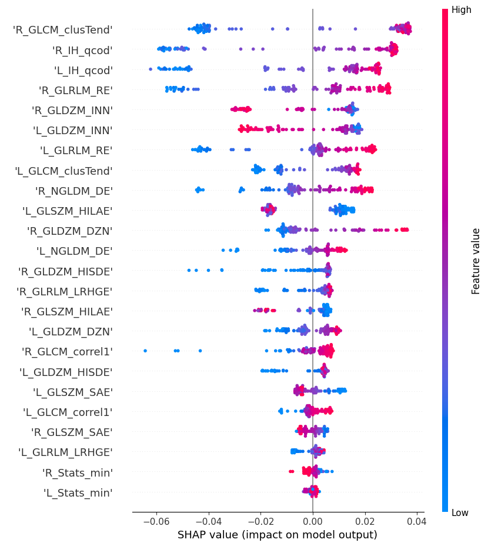
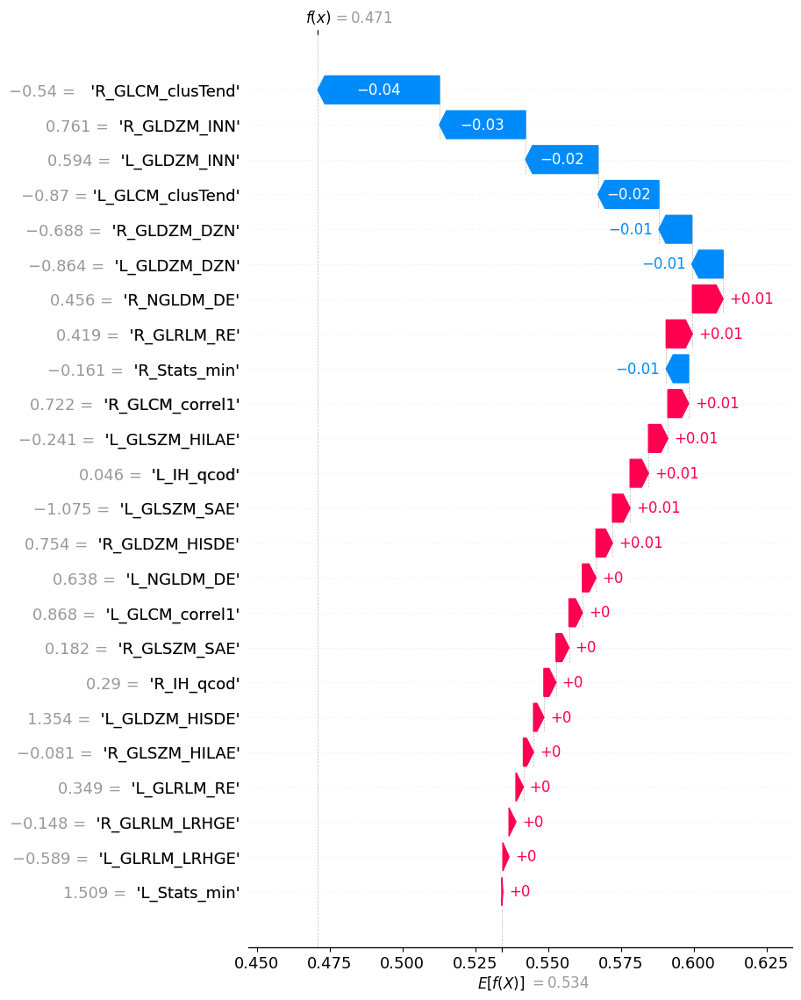
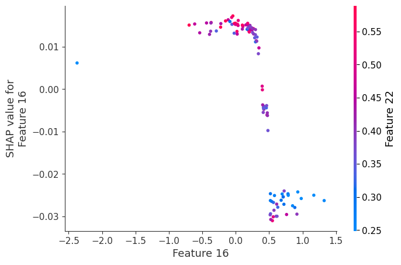

# SHAP Explainer Docker Tool

## Description

The SHAP Explainer Docker Tool is a containerized solution for performing post hoc explainability on handcrafted radiomics machine learning models using SHAP (SHapley Additive exPlanations). SHAP is a powerful tool for interpreting machine learning models and understanding the impact of individual features on model predictions.

This tool allows you to:

- Compute SHAP values for your handcrafted radiomics machine learning model.
- Generate and save global summary plots, local explanation plots, and dependence plots to gain insights into model behavior.

## Setup

To use the SHAP Explainer Docker Tool, you need to have Docker installed on your machine. Docker provides a platform to build, ship, and run applications in containers. Follow the official Docker documentation to install Docker for your operating system: [Docker Installation Guide](https://docs.docker.com/get-docker/)

## Usage

1. Clone this repository to your local machine.

2. Prepare your model and data:
   - Ensure you have a trained handcrafted radiomics machine learning model saved in a file (e.g., `filename_svm.sav`). Save the model using the following method: `pickle.dump(svm, open(filename_svm, 'wb'))`.
   - Prepare your preprocessed handcrafted radiomics features in a format compatible with the model (e.g., a Numpy array) and save it to a file (e.g., `test_file.npy`). Save the preprocessed features using Numpy's `np.save` method.

3. Create a configuration file (`config.ini`) with the required parameters:
   ```
   [DEFAULT]
   model_filename = filename_svm.sav
   test_data_preprocess = test_file.npy
   save_dir_for_plots = test_run
   local_plt_indices_list = 0,1,2
   top_n_dependence_plots = 6
   top_n_dependence_interactions = 4
   feature_names = L_GLCM_clusTend, L_GLCM_correl1, L_GLDZM_DZN, ...
   ```

4. Build the Docker image using the provided Dockerfile:
   ```
   docker build -t shap-exp-tool-img .
   ```

5. Run the Docker container using the built image and the mounted volumes for data and plots:
   ```
   docker run -it --rm -v /path/to/local/data:/home/chaimeleon/datasets shap-exp-tool-img
   ```


6. The tool will compute SHAP values, generate and save global summary plots, local explanation plots, and dependence plots in the specified `save_dir_for_plots` directory.

## Dummy Examples

### Global Explanations:

Global explanations summarize the overall behavior of the machine learning model.  Below is an example of Global explanation plot:

- Summary plot for Class
  


### Local Explanations:

Local explanations provide insights into individual predictions. Below is an example of local explanation plot:

- Local explanation plot
  


### Dependence Plots:

Dependence plots show the relationship between feature values and SHAP values.  Below is an example of dependence plot:

- Dependence plot
  


For any questions or issues with the tool, feel free to reach out. 
